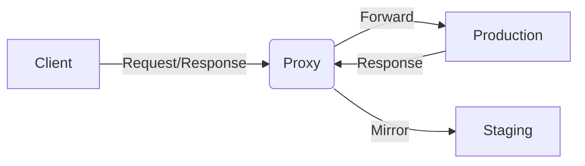

# NGINX Traffic mirroring

This is a simple example of how to use NGINX to mirror traffic from a production server to a staging server.

The proxy server could also be replaced with the production server, but this would require the production server to have the necessary resources to handle the additional traffic.

## How to use
Run `docker compose up` to start the NGINX servers. The production server is available at [localhost](http://localhost:80)  and the staging server is not exposed to the public.

